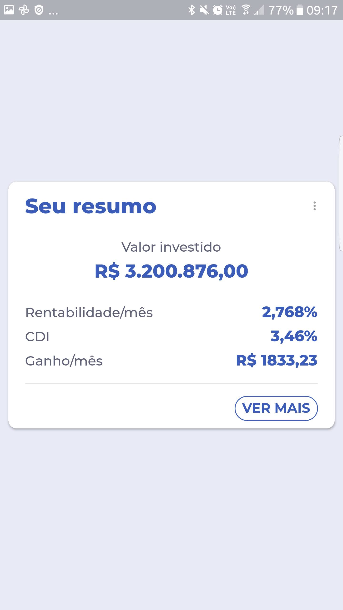
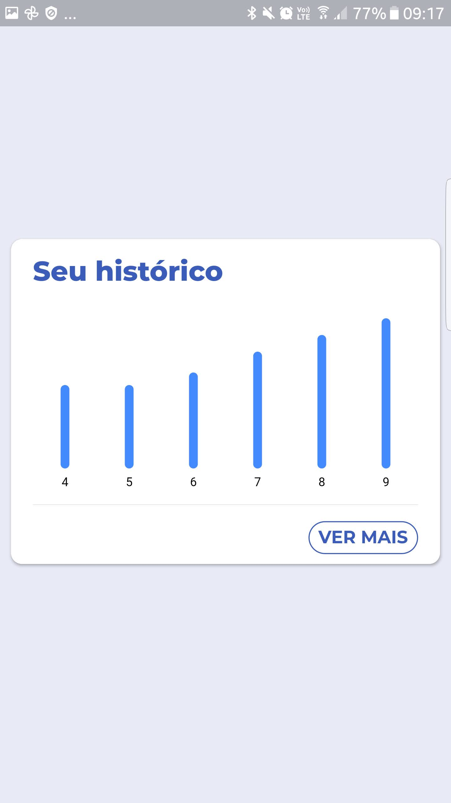
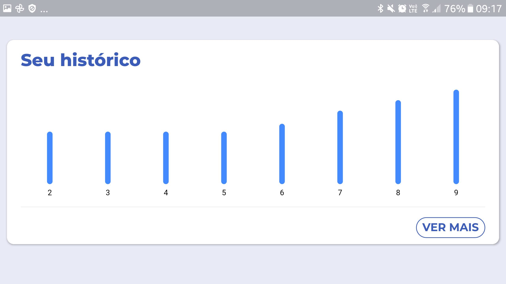
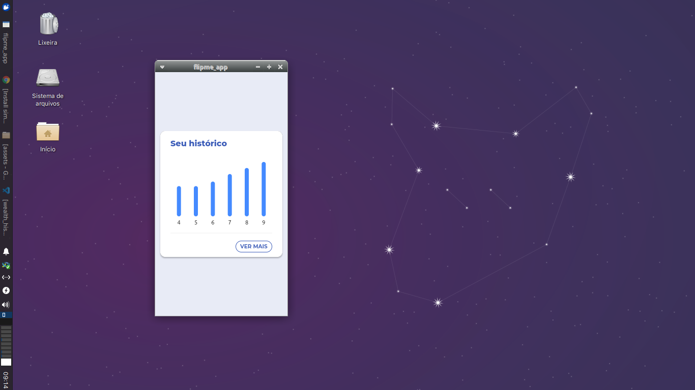
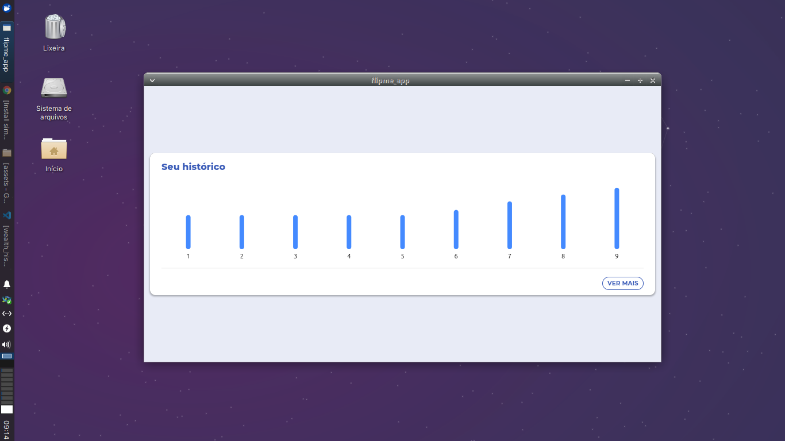

# flipme_app

## Screenshots
<div>
    
    
    
</div>
<div>
    
    
</div>

## Pré-requisitos

Este projeto faz uso de sound null-safety e não funciona com Flutter v1.22 ou inferior, é necessário utilizar Flutter v2. É recomendado utilizar a versão do channel stable.

## Instruções para execução

1. Fazer git clone deste projeto.
2. Criar um arquivo .env na raíz do projeto.
3. Adicionar a chave secreta do Hasura:
```
SECRET=<chave>
```
5. Executar o build_runner para gerar o arquivo env.g.dart na pasta lib.
```
flutter pub run build_runner build
```
6. Seguir com os passos convencionais de build para Flutter
```
flutter pub get
flutter run
```

## Observações

- É possível olhar a evolução do código através das branches no repositório.
- O projeto foi baseado em ideias da Clean Architecture, porém por ser um projeto simples minimizei a geração de boilerplate.
- Gerência de estado foi implementada com MobX (mantém o controller limpo, mas eu usaria também state_notifier ou cubit).
- Foi utilizado o pacote graphql para implementar a comunicação com a API, o que torna possível substituir a implementação no Hasura por outra.
- Utilizei o package pixel_perfect para copiar o design do XD. A diferença principal é que a fonte utilizada é outra, pois a do protótipo não está disponível gratuitamente para uso Também utilizei a compilação do Flutter para Linux para acelerar o processo de desenvolvimento.
- Implementei um gráfico de histórico, porém me atentei mais à exibição dos dados para poder mostrar algo sobre responsividade e uso de gráficos no teste. O gráfico foi implementado com o pacote fl_chart.
